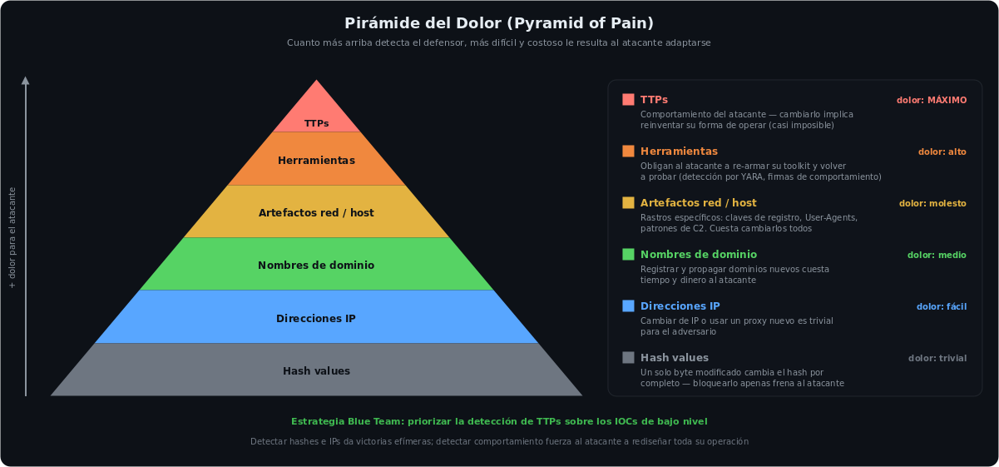
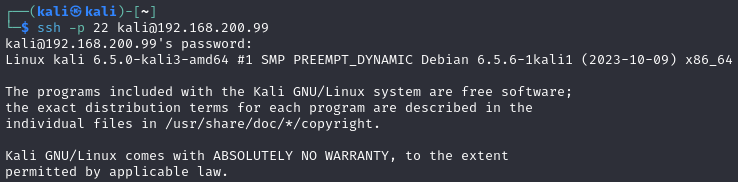
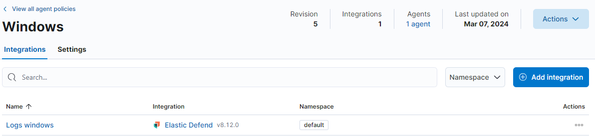
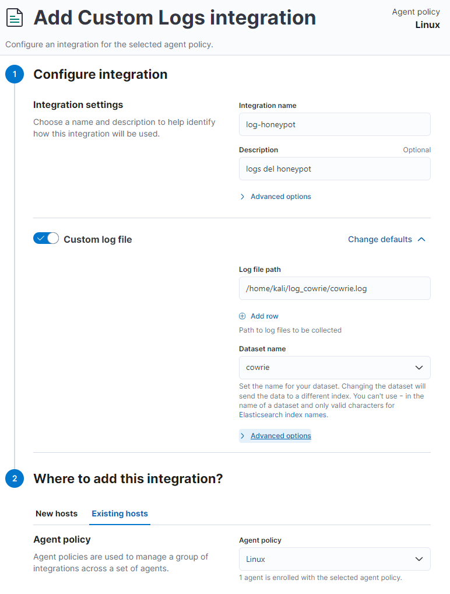
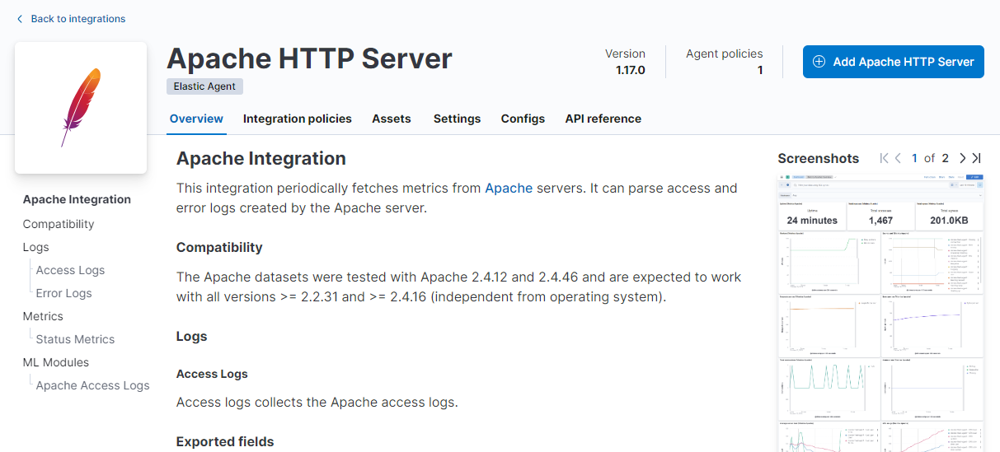
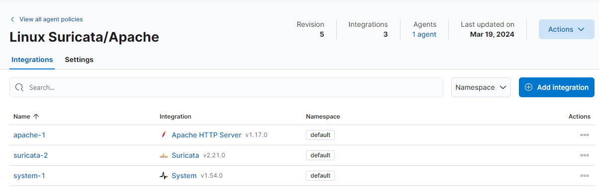
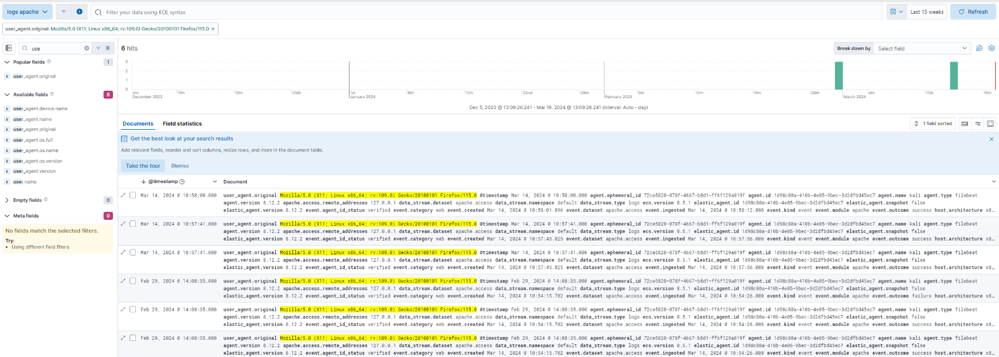

<h1 align="center">Blue Team · Infraestructura SIEM</h1>

<p align="center">
  
  
  
  
  
</p>

---

## Sobre este proyecto

Diseño y despliegue **desde cero** de una infraestructura de red segura y monitorizada, con **pfSense** (un firewall/router) como núcleo de comunicaciones y **Elastic Cloud** como **SIEM** central — el sistema que centraliza los logs de toda la red y los correlaciona para detectar ataques. Simula un entorno empresarial segmentado donde toda la telemetría (endpoints, honeypots, IDS y servicios web) se centraliza para análisis de logs en tiempo real — la base de cualquier operación SOC (*Security Operations Center*).

La red se divide en tres zonas con distinto nivel de confianza:

- **LAN** — equipos internos de confianza (Windows 11 monitorizado)
- **DMZ** — *zona desmilitarizada*: un segmento aislado donde se colocan **honeypots** (señuelos deliberadamente vulnerables —Cowrie SSH + rdpy RDP— para atraer y estudiar a los atacantes) sin arriesgar la red interna
- **DMZ2** — servicios expuestos (Apache) bajo inspección de **Suricata**, un **IDS** (*Intrusion Detection System*: vigila el tráfico y alerta ante patrones de ataque)

---

## Por qué esta arquitectura — la Pirámide del Dolor



La decisión de centralizar **varias fuentes de telemetría** (endpoint, honeypots e IDS) en vez de conformarse con listas de hashes o IPs responde a esta lógica: cuanto más arriba de la pirámide detecta el defensor, más caro le resulta al atacante adaptarse.

- **Honeypots (Cowrie + rdpy)** capturan el **comportamiento** del atacante — herramientas y TTPs (las tácticas y técnicas catalogadas en **MITRE ATT&CK**), la cúspide de la pirámide.
- **Suricata (IDS)** detecta **patrones y artefactos** de red, no solo indicadores estáticos.
- **Elastic Defend en el endpoint** aporta la telemetría de proceso necesaria para correlacionar acciones, no bytes.

Bloquear un hash o una IP frena al atacante unos minutos; detectar su forma de operar lo obliga a rediseñar el ataque. Esta infraestructura está pensada para observar en los niveles altos.

---

## Arquitectura de red

```
Host (WAN / internet)
        │  puerto 222 → 2222 (SSH / Cowrie)
        │  puerto 333 → 3389 (RDP / rdpy)
        │
   ┌─ pfSense UTM (CE 2.7.2) ──────────────────────────┐
   │  WAN   → IP asignada por el host                   │
   │  LAN   → 192.168.100.1/24                          │
   │  DMZ   → 192.168.200.1/24                          │
   │  DMZ2  → 192.168.250.1/24                          │
   └────────────────────────────────────────────────────┘
        │               │                 │
        ▼               ▼                 ▼
   LAN (.100.x)    DMZ (.200.x)      DMZ2 (.250.x)
   Windows 11      Cowrie + rdpy     Apache + Suricata
   endpoint        honeypots         servicio + IDS
        │               │                 │
        └───────────────┴─────────────────┘
                        │
                   Elastic Cloud
                (GCP · Fleet · Kibana)
```

---

## Stack tecnológico

| Componente | Rol | Versión |
|---|---|---|
| pfSense CE | Firewall / router / segmentación | 2.7.2 |
| Elastic Cloud | SIEM central (Elasticsearch + Kibana + Fleet) | 9.x |
| Elastic Agent / Defend | Telemetría de endpoint | 8.12.x |
| Cowrie | Honeypot SSH/Telnet (Docker) | latest |
| rdpy | Honeypot RDP (Docker) | latest |
| Suricata | IDS/IPS sobre DMZ2 | 6.x |
| Apache | Servicio web expuesto | — |
| Kali / Windows 11 | Endpoints del laboratorio | — |

---

## Implementación

### 1. Segmentación con pfSense
Cuatro interfaces (WAN, LAN, DMZ, DMZ2) sobre VirtualBox, cada una en su red interna. DNS Resolver en modo forwarding hacia `1.1.1.1` para que todos los segmentos resuelvan `elastic.co` y envíen logs a la nube. DHCP por zona, con **mapeo estático** del honeypot a `192.168.200.99` (identidad persistente en los logs y NAT estable).

### 2. Firewall con mínimo privilegio
Cada red solo habla por los puertos estrictamente necesarios; todo lo demás se bloquea por defecto.

- **LAN** → acceso total (administración y monitoreo).
- **DMZ (honeypots)** → puede salir a internet (DNS 53, HTTP/HTTPS 80/443 para enviar logs) pero **bloqueada hacia LAN y DMZ2**.
- **DMZ2 (Suricata/Apache)** → misma política: sale a internet para logs, **aislada** de las redes internas.
- **NAT Port Forward** → WAN:222 → `200.99:2222` (Cowrie) y WAN:333 → `200.99:3389` (rdpy), exponiendo los honeypots al exterior sin comprometer la red interna.

### 3. Honeypots en la DMZ
Dos honeypots cubriendo los vectores más atacados:

```bash
# Cowrie — honeypot SSH/Telnet de media interacción
docker run -p 222:2222 cowrie/cowrie > cowrie.log

# rdpy — honeypot RDP con persistencia de logs
docker run -d -p 333:3389 --log-driver=json-file \
  --log-opt max-size=10m -v /var/log/logs-honey:/var/log/rdpy \
  amazedostrich/rdpy
```

Ambos envían su actividad a Elastic mediante la integración **Custom Logs**, con dataset propio por honeypot para filtrar en Kibana.

### 4. SIEM central — Elastic Cloud + Fleet
Tres políticas de agente en `Security > Fleet`:

| Política | Fuente | Integración |
|---|---|---|
| HONEYPOT | Kali DMZ (Cowrie) | Custom Logs |
| WINDOWS | Windows 11 LAN | Elastic Defend |
| SURICATA/APACHE | Kali DMZ2 | Suricata + Apache |

Resultado: **4 agentes en estado Healthy** — los tres de los segmentos (LAN, DMZ, DMZ2) más el agente interno de Elastic Cloud — reportando en tiempo real.

### 5. Análisis de logs en Kibana
Validación end-to-end del pipeline: cada una de las cuatro fuentes se consulta en Kibana Discover con su filtro y su dataset propio, confirmando que la telemetría llega, se indexa y es correlacionable por segmento.

| Fuente | Filtro KQL | Dataset | Qué confirma |
|---|---|---|---|
| **Endpoint (Windows)** | `event.category:"network"` | `endpoint.events.network` | Elastic Defend captura los intentos de conexión salientes del endpoint LAN en tiempo real |
| **Apache (DMZ2)** | `event.module:"apache"` | `apache.access` | Cada petición HTTP GET/200 desde LAN queda registrada con método, código y bytes |
| **Suricata (DMZ2)** | `event_type:"alert"` | `suricata.eve` | El IDS observa los flujos hacia DMZ2 y levanta alertas ante patrones sospechosos |
| **Honeypot (Cowrie)** | `destination.port:2222` | `endpoint.events.network` | Los intentos de acceso SSH al honeypot se capturan aunque la conexión sea rechazada |

**Caso correlacionado** — un intento de conexión desde el Windows de la LAN (`192.168.100.101`) hacia el honeypot Cowrie (`192.168.200.99:2222`) aparece simultáneamente en la telemetría de endpoint (`event.action: connect_attempted`) y, si hubiera cruzado DMZ2, en Suricata — demostrando que el mismo evento es visible y cruzable desde distintas fuentes, que es la base del threat hunting en un SOC.

---

## Objetivos cumplidos

- [x] Infraestructura de red segmentada con múltiples DMZs
- [x] Reglas de firewall con principio de mínimo privilegio
- [x] Honeypots (SSH + RDP) operativos y accesibles desde WAN
- [x] Honeypots aislados de las redes internas
- [x] Fuente adicional en DMZ2 (Apache + Suricata)
- [x] 4 agentes Elastic Healthy con logs centralizados
- [x] Eventos indexados y correlacionados en Kibana por segmento

---

## Evidencia del laboratorio

Capturas propias del montaje, tomadas durante la implementación.

**Enrolamiento de un endpoint Linux (Kali) contra el servidor, vía terminal:**


**Integración de Windows — endpoint enrolado y reportando al SIEM:**


**Configuración de una integración de logs personalizada en Fleet:**


**Integración de Apache HTTP Server — recolección de access/error logs:**


**Política de agente Linux combinando Suricata (IDS) y Apache:**


**Exploración de eventos en Kibana Discover — búsqueda y filtrado de la telemetría:**


---

## Errores comunes evitados

- **DNSSEC activado en laboratorio** → rompe la resolución; se desactiva y se usa forwarding directo.
- **Honeypot sin IP fija** → los logs pierden identidad; se resuelve con DHCP static mapping.
- **Exponer el honeypot en el puerto SSH real (22)** → conflicto con el propio pfSense; se usan 222/333 externos.
- **Olvidar las reglas de salida HTTP/HTTPS en la DMZ** → el agente no puede enviar logs a Elastic Cloud.

---

## Módulos relacionados

- **[Nullsec](https://github.com/juanmalbran/Nullsec-SIEM-ELK)** — proyecto integrador: SIEM con ELK 8.x, ti_misp, Fleet, 4 reglas KQL y detección real de ransomware (Bad Rabbit).
- **[DFIR](https://github.com/juanmalbran/DFIR)** — la evidencia forense es el insumo del incident response en el SOC.
- **[Red-Team](https://github.com/juanmalbran/Red-Team)** — las TTPs que este SIEM está diseñado para detectar.

---

<div align="center">
  <sub>Parte del portfolio de <a href="https://github.com/juanmalbran">Juan Malbrán · M4LBYTE</a></sub>
</div>
